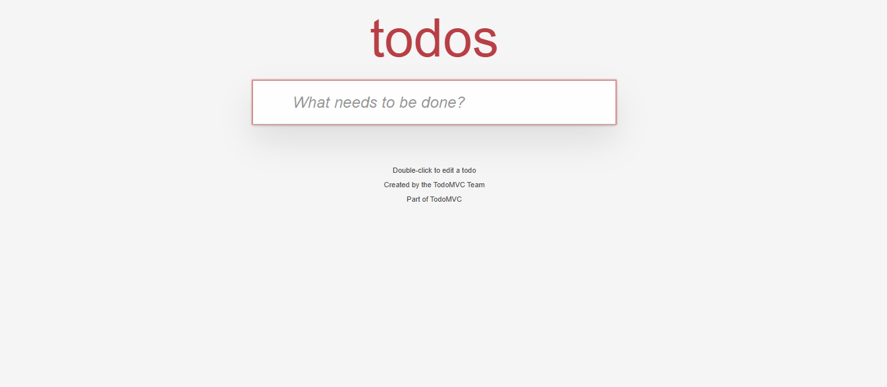
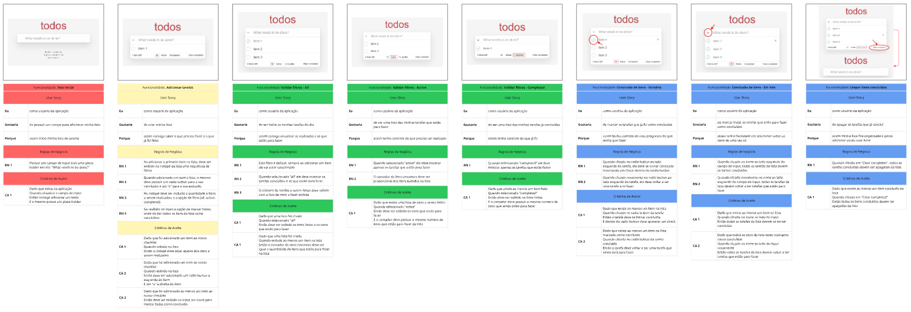

# Teste Manual - TodoMVC
Este projeto tem como finalidade mostrar o meu trabalho de análise de requisitos, plano de teste e a execução de teste do site ToDoMVC.

Neste repositório você irá encontrar um projeto composto por:

- Análise de requisitos do site TodoMVC;
- Plano de teste;
- Execução do teste.

## Análise de requisitos

- Site analisado: [TodoMVC](https://todomvc.com/examples/react/dist/)

- Análise realizada em: [Miro](https://miro.com/app/dashboard/)

## Plano de Teste e Evidência da Execução dos testes

No repositório, dentro da pasta 'excel' está o arquivo onde foi realizado todo o plano de teste e ainda nele há as evidências dos testes que realizei.